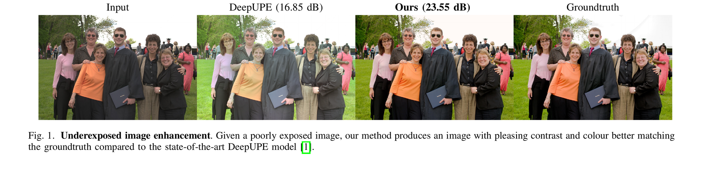
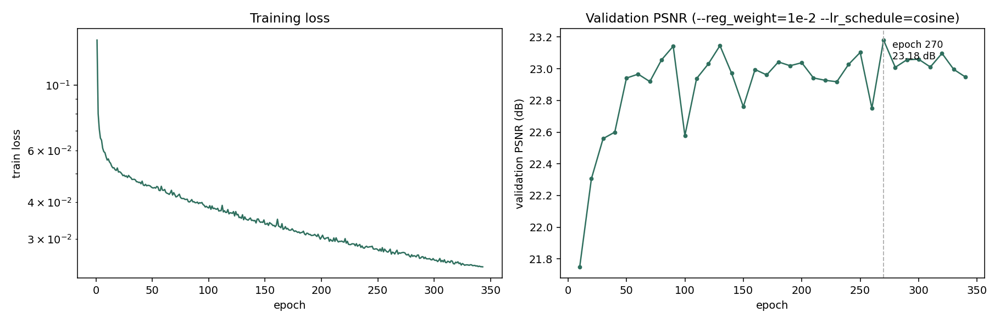
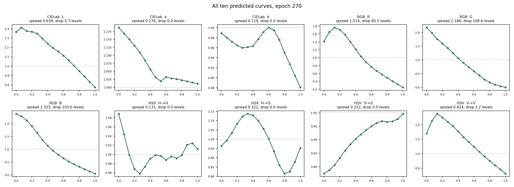
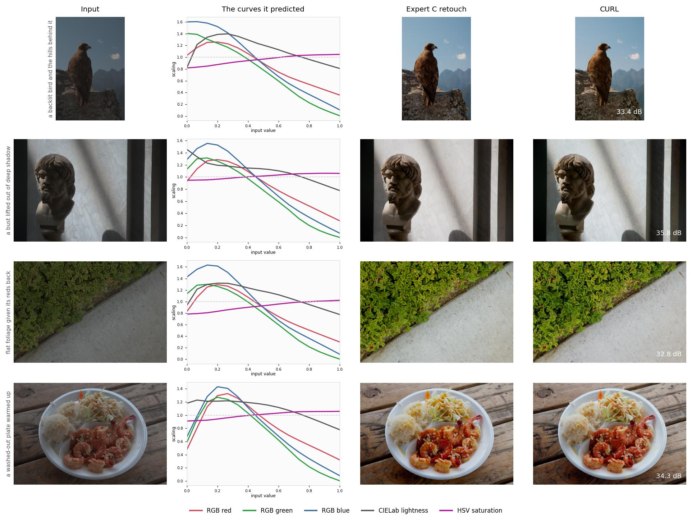

<div align="center">

<h1>CURL</h1>

<p><b>Neural Curve Layers for Global Image Enhancement</b><br>
<sub>ICPR 2020 · Huawei Noah's Ark Lab</sub></p>

[](https://arxiv.org/abs/1911.13175)
[](https://doi.org/10.1109/ICPR48806.2021.9412677)
[](#pre-trained-model)
[](#license)

[Sean Moran](https://sjmoran.github.io/) ·
[Steven McDonagh](https://smcdonagh.github.io/) ·
Greg Slabaugh

[**Paper**](https://arxiv.org/pdf/1911.13175) ·
[**Supplementary**](https://sjmoran.github.io/pdfs/CURL_supplementary.pdf) ·
[**Video**](https://youtu.be/66FnRfDR_Oo) ·
[**Poster**](https://sjmoran.github.io/pdfs/CURL_ICPR_POSTER.pdf) ·
[**Slides**](https://sjmoran.github.io/pdfs/DeepLPFDataBites.pdf)

</div>

Enhancement networks usually learn a mapping straight to output pixels. CURL
instead predicts **tone curves** — the same piecewise-linear curves a raw
converter exposes — and applies them in three colour spaces in turn: CIELab,
RGB, then HSV. Each stage is 16 knots per channel, so the whole enhancement is
160 numbers, and each one says what it did to lightness, to colour, or to
saturation.

<p align="center">

</p>

## Contents

[How it works](#how-it-works) ·
[Install](#install) ·
[Enhance your photos](#enhance-your-photos) ·
[Inference on a split](#inference-on-a-split) ·
[Train it yourself](#train-it-yourself) ·
[Pre-trained model](#pre-trained-model) ·
[Results](#results) ·
[Datasets](#datasets) ·
[Other versions](#other-versions) ·
[Citation](#citation)

## How it works

A **TED** backbone (Transformed Encoder-Decoder) reads the image and produces
per-pixel features. The **CURL** block then runs three curve layers in sequence,
each one a small convolutional head that predicts knot positions from the
features and the current image:

| Stage | Space | Curves | What it adjusts |
|---|---|---|---|
| 1 | CIELab | 3 × 16 knots | lightness and the two chroma axes |
| 2 | RGB | 3 × 16 knots | per-channel tone, so white balance and contrast |
| 3 | HSV | 4 × 16 knots | hue, saturation and value |

Between stages the image is converted into the next space and back, and each
stage's output is blended as a residual. A smoothness regulariser on the knot
spacing, weighted by `--reg_weight`, keeps the curves smoother rather than
jagged, and the training loss combines L1 in RGB, CIELab and HSV with a
cosine term on RGB vectors and MS-SSIM.

Because the output is a set of curves rather than a painted image, the
enhancement is global, resolution-independent, and can be read off and applied
elsewhere. The [paper](https://arxiv.org/pdf/1911.13175) gives the full
formulation.

<p align="center">
<a href="https://www.youtube.com/watch?v=66FnRfDR_Oo"></a>
</p>

## Install

```bash
git clone https://github.com/huawei-noah/noah-research.git
cd noah-research/CURL
pip install -e .
```

Python 3.9 or newer. Torch comes from your platform's usual wheel; if you
already have a CUDA or ROCm build, keep it — installing the generic one would
replace it and the GPU goes with it.

## Enhance your photos

```bash
curl-enhance enhance photo.jpg               # one file
curl-enhance enhance ~/photos --out ~/done   # or a whole directory
```

Results land in `enhanced/` as PNGs. PNG, JPEG, TIFF, BMP and WebP are read,
greyscale and RGBA included. The device is picked for you — CUDA, Apple Silicon
(MPS), or CPU — and `--device` overrides it. A file that cannot be read is
reported and skipped rather than taking the rest of the batch down with it.

| | |
|---|---|
| Model size | 1.7M parameters |
| Input | any resolution with both edges ≥ 48 px |

## Inference on a split

To score a dataset split rather than enhance loose files, the bundled example
uses the checkpoint in `pretrained_models/adobe_dpe/`:

1. Put the images to enhance in a directory whose path contains the word
   `input`, e.g. `./adobe5k_dpe/curl_example_test_input/`.
2. Put the matching ground-truth images in a directory whose path contains the
   word `output`, e.g. `./adobe5k_dpe/curl_example_test_output/`.
3. List the image names, without extensions, in a text file one directory up,
   e.g. `./adobe5k_dpe/images_inference.txt`.
4. Run:

```bash
python3 main.py \
  --inference_img_dirpath=./adobe5k_dpe/ \
  --checkpoint_filepath=./pretrained_models/adobe_dpe/curl_validpsnr_23.18146999041522_validloss_0.05043014452109734_testpsnr_24.1456055407235_testloss_0.04208333077654242_epoch_270_model.pt
```

Results are written to a timestamped directory next to `main.py`, one image per
input with its PSNR and SSIM in the filename. The device is picked for you —
CUDA, Apple Silicon (MPS), or CPU.

As written, over the thirteen bundled examples, that command reports **29.43
dB / 0.957 SSIM**.

## Train it yourself

Point it at a directory holding `input/` and `output/` folders and one text
file per split listing the image ids:

```bash
python3 main.py \
  --training_img_dirpath=./adobe5k_dpe_data/ \
  --num_epoch=500 \
  --reg_weight=1e-2 \
  --lr_schedule=cosine \
  --seed=0
```

Checkpoints are written whenever validation PSNR improves, into a timestamped
`log_*` directory with the metrics in the filename.

`--reg_weight` scales the smoothness penalty on the predicted curves;
`--lr_schedule=cosine` anneals the learning rate to `--lr_min` over
`--num_epoch`, which is what the shipped checkpoint was trained with over 500
epochs. `--batch_size` above 1 needs `--crop_size`, because the
images vary in size and cannot otherwise be stacked. Evaluation and
inference always run at a batch size of 1, so per-image PSNR and SSIM are
reported and saved individually. On CUDA, `--tf32`, `--compile` and
`--amp bf16` are available.

### Watching the curves

The curves are the point of the method, so the training loop can record them:

```bash
python3 main.py --training_img_dirpath=./data/ --dump_curves_every=5
python3 tools/plot_curves.py log_*/curves.jsonl -o curves.png
```

Every fifth epoch, one fixed validation image goes through the network and all
ten predicted curves are appended to `curves.jsonl`, along with each curve's
spread and its curvature. `tools/plot_curves.py` draws the knot trajectories
over the run and the curvature against epoch.

<p align="center">

</p>

All ten predicted curves for one validation image, at the epoch the shipped
checkpoint was selected:

<p align="center">

</p>

## Results

| Model | Split | PSNR | SSIM |
|---|---|---|---|
| the checkpoint in this repo, epoch 270 | DPE | **24.15 dB** | 0.915 |
| CURL as published (Table 3) | DPE | 24.04 dB | 0.900 |

FiveK is reported under several incompatible protocols — different test sets,
input renderings and resolutions — so a FiveK number is only comparable with
another measured the same way. See the
[protocol table](https://github.com/sjmoran/deeplpf-image-enhancement/blob/master/docs/BENCHMARK_TABLE.md).
The checkpoint above trains on the DPE lists shipped in
[`adobe5k_dpe/`](./adobe5k_dpe/), with `--reg_weight=1e-2` and
`--lr_schedule=cosine`, selected at the epoch with the best validation PSNR
over 500 epochs.

### Examples

Input, the curves CURL predicted for it, the Expert C retouch, and the result.
The curves are the whole enhancement: a lift through the shadows, a roll-off
through the highlights, and a gentle rise in saturation, read straight off the
network's output.

<p align="center">

</p>

Regenerate it for any checkpoint with:

```bash
python3 tools/curve_gallery.py . <checkpoint> gallery.jpg
```

## Datasets

- **Adobe-DPE** (5000 RGB→RGB pairs): download
  [here](https://data.csail.mit.edu/graphics/fivek/), then pre-process per the
  DeepPhotoEnhancer (DPE) [paper](https://github.com/nothinglo/Deep-Photo-Enhancer);
  Expert C retouching is the target and the images must be exported in sRGB.
  See the
  [DPE instructions](https://github.com/nothinglo/Deep-Photo-Enhancer/issues/38#issuecomment-449786636).
  The splits used here are in [`adobe5k_dpe/`](./adobe5k_dpe/).

- **Adobe-UPE** (5000 RGB→RGB pairs): same download, pre-processed per the
  DeepUPE [paper](https://github.com/wangruixing/DeepUPE) and
  [this issue](https://github.com/wangruixing/DeepUPE/issues/26). Expert C is
  the target. Test images
  [here](https://drive.google.com/file/d/1HZnNgptNxjKJAhekz2K5yh0mW0yKIws2/view?usp=sharing).

- **Samsung S7** (110 RAW→RGB pairs): download
  [here](https://www.kaggle.com/knn165897/s7-isp-dataset). Training uses random
  512×512 crops; everything not listed below is training data.

<details>
<summary>S7 validation and test image lists</summary>

**Validation**

```
S7-ISP-Dataset-20161110_125321   S7-ISP-Dataset-20161109_131627
S7-ISP-Dataset-20161109_225318   S7-ISP-Dataset-20161110_124727
S7-ISP-Dataset-20161109_130903   S7-ISP-Dataset-20161109_222408
S7-ISP-Dataset-20161107_234316   S7-ISP-Dataset-20161109_132214
S7-ISP-Dataset-20161109_161410   S7-ISP-Dataset-20161109_140043
```

**Test**

```
S7-ISP-Dataset-20161110_130812   S7-ISP-Dataset-20161110_120803
S7-ISP-Dataset-20161109_224347   S7-ISP-Dataset-20161109_155348
S7-ISP-Dataset-20161110_122918   S7-ISP-Dataset-20161109_183259
S7-ISP-Dataset-20161109_184304   S7-ISP-Dataset-20161109_131033
S7-ISP-Dataset-20161110_130117   S7-ISP-Dataset-20161109_134017
```

</details>

## Other versions

The TED backbone is available on its own: `rgb_ted.py` for RGB images,
`raw_ted.py` for RAW.

This code is also maintained as a standalone repository at
[sjmoran/curl-image-enhancement](https://github.com/sjmoran/curl-image-enhancement),
tagged
[v1.0.0](https://github.com/sjmoran/curl-image-enhancement/releases/tag/v1.0.0),
which is where the checkpoint above was trained.

Three community contributions exist. None has been tested by the paper's
authors, and copies of each are mirrored there.

| Contribution | By |
|---|---|
| Refactored CURL ([issue 31](https://github.com/sjmoran/CURL/issues/31)) | [mahdip72](https://github.com/mahdip72/CURL) |
| Batch size > 1 ([issue 27](https://github.com/sjmoran/CURL/issues/27)) | [barbodpj](https://github.com/barbodpj) |
| RGB model and weights | [hermosayhl](https://github.com/hermosayhl) |

## Repository layout

| | |
|---|---|
| `main.py` | entry point, dispatching to training or inference |
| `cli.py` · `train.py` · `inference.py` | arguments, the training loop, running a checkpoint |
| `model.py` · `losses.py` · `blocks.py` | the network, the loss, the conv blocks |
| `colour.py` · `curves.py` | colour-space conversions and the curve arithmetic |
| `metrics.py` · `images.py` · `tensors.py` | PSNR/SSIM, image I/O, shape helpers |
| `curl_cli.py` | the `curl-enhance` command |
| `curvelog.py` · `tools/plot_curves.py` | recording and plotting the predicted curves |
| `test_curl.py` | 42 CPU-only tests, no dataset needed |

```bash
python3 -m pytest test_curl.py
```

The suite covers the colour round-trips and their known anchors, the curve's
interpolation of its knots and the locality of each knot, gradient flow into
every parameter, the loss and metric invariants, shape handling from 48 px
upwards, and the checkpoint contract.

## Citation

```
@INPROCEEDINGS{moran2020curl,
  author={Moran, Sean and McDonagh, Steven and Slabaugh, Gregory},
  booktitle={2020 25th International Conference on Pattern Recognition (ICPR)},
  title={CURL: Neural Curve Layers for Global Image Enhancement},
  year={2021},
  pages={9796-9803},
  doi={10.1109/ICPR48806.2021.9412677}}
```

## License

BSD-3-Clause.

## Contributing

Bug fixes are welcome as pull requests. For new features or extensions, open an
issue first so the shape can be agreed before the work is written. If you are
training CURL and run into trouble, open an issue — we are happy to help.
