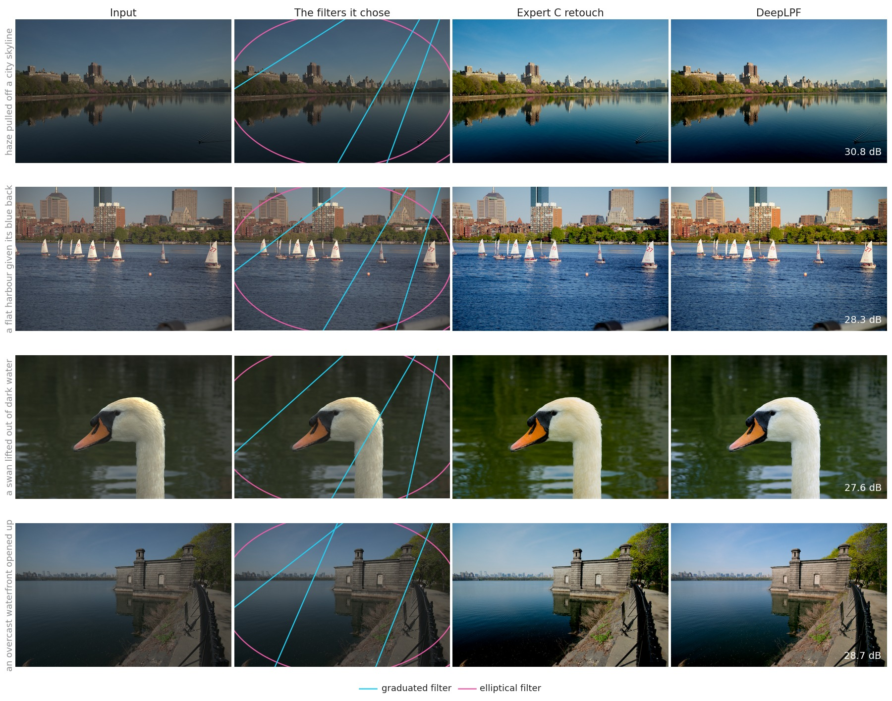
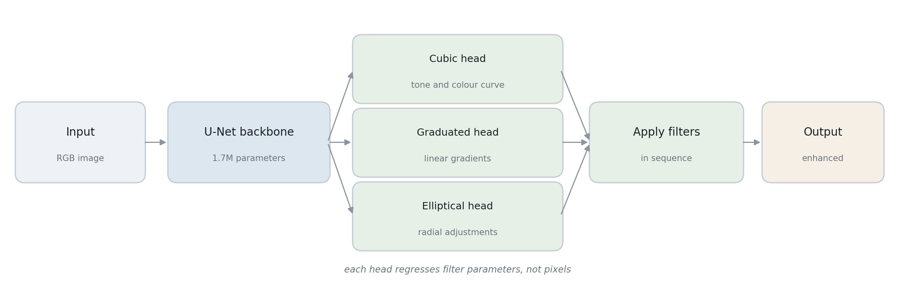
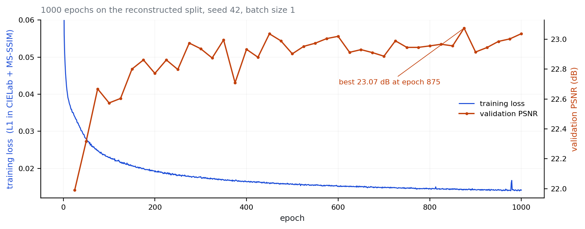

<div align="center">

<h1>DeepLPF</h1>

<p><b>Deep Local Parametric Filters for Image Enhancement</b><br>
<sub>CVPR 2020 · Huawei Noah's Ark Lab</sub></p>

[](https://arxiv.org/abs/2003.13985)
[](https://www.python.org/)
[](https://pytorch.org/)
[](#pre-trained-model)
[](./LICENSE)

[Sean Moran](https://sjmoran.github.io/) ·
[Pierre Marza](https://pierremarza.github.io/) ·
[Steven McDonagh](https://smcdonagh.github.io/) ·
[Sarah Parisot](https://parisots.github.io/) ·
Greg Slabaugh

[**Paper**](https://arxiv.org/abs/2003.13985) ·
[**Poster**](https://github.com/sjmoran/sjmoran.github.io/blob/main/pdfs/DeepLPF_CVPR20_poster.pdf) ·
[**Video**](https://www.youtube.com/watch?v=Sxach3FM6FY) ·
[**Supplementary**](https://github.com/sjmoran/sjmoran.github.io/blob/7775d1fc39d14baeb6935f6c750f923e1251f491/pdfs/DeepLPF_supplementary.pdf)

</div>

```bash
pip install -e .
deeplpf enhance photo.jpg
```

Most enhancement networks paint the output pixel by pixel. DeepLPF instead
predicts the settings of a few filters a photographer would recognise - a tone
curve, a graduated filter, an elliptical vignette - and applies them to your
image. The whole model is 1.7M parameters, runs in 46 ms on an Apple GPU, and
tells you what it did.

<p align="center">

</p>

<div align="center"><sub>Four photographs from the FiveK test set, none seen
during training, at 27.6 to 30.8 dB against the Expert C retouch. The second
column draws the filters the model actually predicted over the photograph:
cyan for the graduated filter, pink for the elliptical.</sub></div>

## Contents

[Install](#install) ·
[Enhance your photos](#enhance-your-photos) ·
[How it works](#how-it-works) ·
[Results](#results) ·
[Pre-trained model](#pre-trained-model) ·
[Train it yourself](#train-it-yourself) ·
[Which number, which protocol](#which-number-which-protocol) ·
[Datasets](#datasets) ·
[Citation](#citation)

## Install

```bash
git clone https://github.com/huawei-noah/noah-research.git
cd noah-research/DeepLPF
pip install -e .
```

Python 3.11 or newer. Torch comes from your platform's usual wheel; if you
already have a CUDA or ROCm build installed, keep it - the lower bounds in
`requirements.txt` would otherwise pull the generic one.

## Enhance your photos

```bash
deeplpf enhance photo.jpg               # one file
deeplpf enhance ~/photos --out ~/done   # or a whole directory
```

Results land in `enhanced/` as PNGs. PNG, JPEG, TIFF, BMP and WebP are read,
greyscale and RGBA included. The device is picked for you - CUDA, Apple Silicon
(MPS), or CPU - and `--device` overrides it. A file it cannot use is reported
and skipped rather than taking the rest of the batch down with it.

| | |
|---|---|
| Model size | 1.7M parameters, 6.9 MB |
| Speed, 512x341 image | 46 ms on an M-series GPU, 0.21 s on CPU |
| Input | any resolution with both edges >= 32 px |

## How it works

<p align="center">

</p>

A U-Net backbone reads the image and produces per-pixel features. Three heads
turn those features into filter parameters, and the filters are applied in
sequence. The whole enhancement is a few dozen numbers.

### What the filters actually do

<p align="center">

</p>

<div align="center"><sub>The two masks are the ones the trained model predicted
for this photograph, averaged over the colour channels. Each is scaled to its
own range: these adjustments are a few per cent, which is what makes them look
like a retouch rather than a filter preset.</sub></div>

**Cubic** — a tone and colour curve, applied to the whole image. It is a cubic
polynomial in the pixel's intensity and its position, so it can lift shadows,
roll off highlights and warm or cool the picture, the way the basic panel of a
raw converter does. This is where most of the enhancement happens.

**Graduated** — the graduated neutral-density filter a landscape photographer
slides over the lens: brighter on one side of a line, darker on the other, with
a smooth transition between. The network predicts where the line falls and how
strong the effect is. In the example above it runs diagonally, brightening the
skyline by about 26% at one edge and 10% at the other.

**Elliptical** — a radial filter, the soft oval used to lift a face out of its
background or to add a vignette. The network predicts the ellipse's centre, its
two axes and its rotation. Above, it lifts the middle of the frame by up to 8%
and leaves the corners alone.

Each filter predicts three instances per image, and their effects multiply, so
the model can place three gradients and three ellipses at once. Because these
are the adjustments a photographer already knows, an enhancement can be read
and argued with rather than only looked at. The
[paper](https://arxiv.org/abs/2003.13985) gives the full formulation.

## Results

| Model | Split | PSNR | SSIM |
|---|---|---|---|
| the checkpoint in this directory, 1000 epochs | reconstructed | 24.18 dB | 0.917 |
| the checkpoint in this directory, 774 epochs | DPE | 23.83 dB | 0.916 |
| DeepLPF as published (NamedCurves Tab. 1) | DPE | 23.93 dB | 0.903 |

FiveK has at least five incompatible protocols; see [Which number, which
protocol](#which-number-which-protocol) before comparing anything to anything.

## Pre-trained model

`pretrained_models/adobe_dpe/` holds the model trained by this code for 1000
epochs on the reconstructed split, and it is what `deeplpf enhance` loads by
default.

`pretrained_models/adobe_dpe_recovered_split/` holds a second checkpoint,
trained on the original DPE split lists, at the epoch where validation PSNR
peaked (774). Same architecture and training command, different split.

Two capabilities are off by default. Both change the architecture, so a
checkpoint trained with either needs the same flag to load it:

```bash
--learn_filter_count   # learn how many filter instances each image needs
--colour_head          # add a global colour mixer and per-channel tone curve
```

The first predicts a gate per filter instance and penalises the mean gate, so
the network can switch instances off. The second supplies the cross-channel
operation the filter bank otherwise lacks: every head is diagonal, so without it
no filter can express white balance, saturation or a hue shift.

## Train it yourself

Prepare the dataset (see [Datasets](#datasets)) into a directory with `input/`
and `output/` sub-folders, with one text file per split listing the image ids,
then:

```bash
python3 main.py \
  --training_img_dirpath=./adobe5k_dpe_data/ \
  --train_img_list_path=./adobe5k_dpe/images_train.txt \
  --valid_img_list_path=./adobe5k_dpe/images_valid.txt \
  --test_img_list_path=./adobe5k_dpe/images_test.txt \
  --batch_size=1
```

`--batch_size=1` is the paper's setup; larger batches need `--crop_size`,
because FiveK images vary in size. Evaluation always runs at batch size 1 so
per-image PSNR and SSIM are reported and saved. On an Ampere-or-later GPU,
`--cuda_graphs` cuts the step time by about 4.7x and `--compile` a little more.
Checkpoints are written whenever validation PSNR improves, into a timestamped
`log_*` directory with the metrics in the filename.

A 1000-epoch run takes roughly 19 hours on an A10G. This is the run that
produced the checkpoint in this directory:

<p align="center">

</p>

The split lists, the Lightroom export recipe, the dataset organise and verify
scripts, and the reference manifest that checks an export image by image, live
in the maintained mirror at
[sjmoran/deeplpf-image-enhancement](https://github.com/sjmoran/deeplpf-image-enhancement),
which is where the checkpoint above was trained.

## Which number, which protocol

DeepLPF appears in the literature as **23.63**, **23.90**, **23.93**, **24.48**
and **24.73** dB. All five are correct, and none is comparable with another:
they are five different protocols, differing in the test set, the input
rendering and the resolution. Every method on FiveK has this problem, and it is
the most common way comparisons go wrong.

**[docs/BENCHMARK_TABLE.md](https://github.com/sjmoran/deeplpf-image-enhancement/blob/master/docs/BENCHMARK_TABLE.md)**
says which number belongs to which protocol, what each protocol is, and which
split files reproduce it.

## Datasets

DeepLPF is trained on the [MIT-Adobe FiveK](https://data.csail.mit.edu/graphics/fivek/)
photographs, processed through Lightroom with Expert C retouching as the
target. For a step-by-step walkthrough — Lightroom export settings, the
expected folder layout, and the helper and verification scripts — see
**[docs/ADOBE_DPE_DATASET.md](https://github.com/sjmoran/deeplpf-image-enhancement/blob/master/docs/ADOBE_DPE_DATASET.md)**.

- **Adobe-DPE** (5000 RGB→RGB pairs): download
  [here](https://data.csail.mit.edu/graphics/fivek/), then pre-process per the
  DeepPhotoEnhancer (DPE) [paper](https://github.com/nothinglo/Deep-Photo-Enhancer),
  using the `InputAsShotZeroed` Lightroom rendering as input and Expert C as
  target, both exported in sRGB at long edge 512 px. See the
  [DPE instructions](https://github.com/nothinglo/Deep-Photo-Enhancer/issues/38#issuecomment-449786636)
  and [Train it yourself](#train-it-yourself).

  The original DPE train/valid/test splits (2250 / 2250 / 498) were recovered in
  September 2026 from a third-party mirror of the DPE release after every
  official link went dead; they are shipped, with their provenance, in the
  [mirror repository](https://github.com/sjmoran/deeplpf-image-enhancement/tree/master/adobe5k_dpe).
- **Adobe-UPE** (5000 RGB→RGB pairs): download
  [here](https://data.csail.mit.edu/graphics/fivek/), then pre-process per the
  DeepUPE [paper](https://github.com/wangruixing/DeepUPE).

## Citation

If you use DeepLPF, its pre-trained models, or this code in your research, please cite:

```
@InProceedings{Moran_2020_CVPR,
author = {Moran, Sean and Marza, Pierre and McDonagh, Steven and Parisot, Sarah and Slabaugh, Gregory},
title = {DeepLPF: Deep Local Parametric Filters for Image Enhancement},
booktitle = {Proceedings of the IEEE/CVF Conference on Computer Vision and Pattern Recognition (CVPR)},
month = {June},
year = {2020}
}
```

## Errata for papers referencing DeepLPF

**[Deep Symmetric Network for Underexposed Image Enhancement with Recurrent Attentional Learning](https://www.shaopinglu.net/publications_files/ICCV21_Image_Enhancement.pdf)**

The results in Fig. 1 for DeepLPF in that paper are incorrect. An example of
inference for one of the images in Fig. 1 is
[here](https://github.com/sjmoran/DeepLPF/blob/ecdc6f08cc96ff727a8246874bce06726949068e/images/004668_TEST_25_354_PSNR_21.848_SSIM_0.858.jpg),
and our DeepLPF model trained on their dataset is
[here](https://github.com/sjmoran/DeepLPF/blob/7b147dd819b2e4c8e9898c411f23887250cb9afe/pretrained_models/adobe_distort_and_recover/deeplpf_validpsnr_23.629675866286313_validloss_0.030986817553639412_testpsnr_23.629675866286313_testloss_0.030986817553639412_epoch_49_model.pt).
The quantitative results in Table 1 for DeepLPF should be **23.63 dB, 0.875
SSIM**. On 29th September 2021 the paper's authors published an
[errata](https://www.shaopinglu.net/proj-iccv21/ImageEnhancement.html); we
thank them for re-checking the result.

## License

Released under the MIT License. See [LICENSE](./LICENSE).

## Contributions

Bug fixes are welcome as pull requests. For new features, utility functions or
extensions to the core, please open an issue first so the shape can be agreed
before the work is written.

【This open source project is not an official Huawei product, Huawei is not expected to provide support for this project.】
